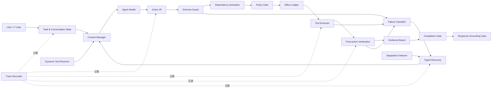

# SafeDesk 核心模块开发计划

> 文档状态：开发规划稿  
> 适用范围：SafeDesk 核心 Harness、DeerFlow 集成、AppWorld 与 τ² Benchmark 接入  
> 关联文档：`SafeDesk_需求清单.md`  
> 核心目标：在不更换基础模型的情况下，通过可维护的 Harness 提升 Agent 的任务完成率、执行可靠性、安全性和 Token 效率。

---

# 1. 项目背景

DeerFlow 已经提供模型调用、工具调用、线程、Checkpoint、流式运行等 Agent 基础设施。SafeDesk 不重新实现一个 Agent Framework，而是在现有 Agent Runtime 外围建立可靠执行层。

SafeDesk 的职责是：

```text
把用户目标维护成结构化任务状态
→ 把模型提出的动作转换成统一 Action IR
→ 在执行前检查 Schema、依赖、策略和重复副作用
→ 在执行后验证真实环境状态
→ 根据证据判断任务是否真正完成
→ 对失败和停滞执行有限、类型化恢复
→ 在长轨迹中维护稳定、低成本的模型上下文
```

SafeDesk 的四个核心模块为：

| 核心模块 | 解决的核心问题 |
| --- | --- |
| **State & Verification** | 目标漂移、子任务遗漏、假完成、结果不一致 |
| **Tool Execution Guard** | 参数错误、重复副作用、错误并行、政策违规和工具缺失 |
| **Recovery Controller** | 失败后盲目重试、执行循环、长期无进展和跑满轮数 |
| **Context Manager** | Token 膨胀、关键信息丢失、长轨迹退化 |

Action IR、AgentGate、Typed State Store 和 Trace Recorder 是四个核心模块共享的公共底座，不作为独立产品能力计算。

---

# 2. 当前基线

当前已经完成 DeepSeek V4 Flash、关闭 Thinking、AppWorld `test_challenge` 全量 417 个任务的基线。

| 指标 | 当前基线 |
| --- | ---: |
| TGC | 174 / 417，41.73% |
| SGC | 41 / 139，29.50% |
| 假完成率 | 153 / 327，46.79% |
| Max-Turn Rate | 91 / 417，21.82% |
| 重复写操作率 | 128 / 1836，6.97% |
| Invalid Call Rate | 559 / 15066，3.71% |
| 平均 Token | 484,350 / 任务 |

基线暴露出的主要问题：

1. 90 个任务没有调用 `complete_task`。
2. 153 个任务调用了 `complete_task`，但最终评测失败。
3. 91 个任务达到 50 轮上限。
4. 217 个任务尝试调用活动 Schema 外的工具。
5. 179 个任务出现重复工具调用。
6. 40 个任务出现重复写操作。
7. 失败任务平均消耗约 73.8 万 Token，成功任务平均约 13.1 万 Token。

这些指标既是开发动机，也是后续模块验收和消融实验的固定对照组。

---

# 3. 设计原则

## 3.1 确定性控制优先

模型可以：

- 拆解任务；
- 提议状态更新；
- 选择工具；
- 生成参数；
- 提议恢复方案；
- 生成最终回复。

模型不能直接决定：

- 工具调用是否合法；
- 当前动作是否有权限；
- 写操作是否已经执行过；
- 工具是否真实改变环境；
- 子任务是否已经验证完成；
- 整个任务是否允许结束；
- 最终回复是否可以宣称成功。

上述判断必须由结构化状态和确定性模块完成。

## 3.2 单一事实源

模型消息历史不是任务状态的事实源。正式事实只来自：

```text
Task State
Evidence Board
Effect Ledger
Verification Result
Failure Record
Conversation State
```

Context Manager 只能读取这些状态并构造上下文，不能创建未经验证的新事实。

## 3.3 所有副作用经过统一入口

所有外部动作都转换为 Action IR 并通过 AgentGate：

```text
LangChain Tool
MCP Tool
Shell Command
AppWorld API
τ² Tool
Subagent Action
        ↓
     Action IR
        ↓
     AgentGate
```

任何 Benchmark Adapter 都不能绕过 AgentGate 直接执行有副作用的动作。

## 3.4 Benchmark 公平性

- 不读取 AppWorld 隐藏 `required_apis` 或测试 Ground Truth。
- Runtime Verifier 与 Benchmark Evaluator 严格分离。
- Dynamic Tool Resolver 只能使用公开 Tool Catalog。
- 基线和 SafeDesk 实验使用相同模型、Thinking 配置、任务集合和轮数上限。
- `test_normal` 和 `test_challenge` 不用于逐任务规则调试。

## 3.5 可消融

四个核心模块都必须支持独立 Feature Flag。不能一次将所有逻辑写进一个 Middleware，否则无法判断提升来自哪里。

---

# 4. 总体架构



## 4.1 建议目录结构

```text
agentgate-core/
  pyproject.toml
  src/agentgate_core/
    contracts/
      task.py
      action.py
      evidence.py
      effect.py
      verification.py
      failure.py
      context.py
      trace.py
    runtime/
      coordinator.py
      state_store.py
      feature_flags.py
    state_verification/
      task_reducer.py
      evidence_board.py
      verifier.py
      completion_gate.py
      response_grounding.py
    tool_execution_guard/
      catalog.py
      schema_guard.py
      dependency_scheduler.py
      policy_gate.py
      effect_ledger.py
      dynamic_resolver.py
    recovery_controller/
      classifier.py
      strategies.py
      stagnation.py
      budget.py
    context_manager/
      builder.py
      budget.py
      compressor.py
      retrieval.py
    tracing/
      recorder.py
      replay.py
      metrics.py

agentgate-deerflow/
  src/agentgate_deerflow/
    middleware.py
    state_adapter.py
    tool_adapter.py
    journal_adapter.py

benchmark-adapters/
  appworld/
    catalog_adapter.py
    executor_adapter.py
    verifier_adapter.py
  tau2/
    catalog_adapter.py
    conversation_adapter.py
    policy_adapter.py
```

`agentgate-core` 不依赖 DeerFlow、AppWorld 或 τ²。框架和 Benchmark 差异只能通过 Adapter 接入。

---

# 5. 公共底座

## 5.1 核心数据对象

第一阶段必须先确定以下对象的字段和状态机。

### TaskContract

```text
task_id
original_instruction
normalized_goal
subgoals
constraints
completion_conditions
allowed_effects
forbidden_effects
required_confirmations
version
created_at
```

### ActionIR

```text
action_id
task_id
actor
tool_name
operation
resource_type
resource_id
arguments
expected_effects
required_evidence
dependency_ids
idempotency_key
risk_level
source_turn
```

### EvidenceItem

```text
evidence_id
subject
predicate
value
source_type
source_event_id
observed_at
scope
confidence
verification_status
valid_until
supersedes
```

### EffectRecord

```text
effect_id
action_id
idempotency_key
operation
resource
expected_change
actual_change
status
verification_id
created_at
updated_at
```

### VerificationResult

```text
verification_id
action_id
verifier_name
expected_state
observed_state
status
field_differences
unintended_effects
evidence_ids
checked_at
```

### FailureRecord

```text
failure_id
action_id
failure_type
message
retryable
responsible_layer
evidence_ids
attempt_count
recovery_budget_remaining
status
```

## 5.2 Typed State Store

State Store 至少提供：

```python
get_task_state(task_id)
apply_task_event(task_id, event, expected_version)
append_evidence(task_id, evidence)
append_effect(task_id, effect)
append_verification(task_id, verification)
append_failure(task_id, failure)
create_checkpoint(task_id)
restore_checkpoint(task_id, checkpoint_id)
```

要求：

- 使用乐观并发版本号，避免并行 Middleware 覆盖状态。
- 状态更新必须由 Event 驱动，不能直接修改任意字段。
- 支持内存实现用于单元测试。
- 支持 SQLite 或项目现有持久化实现用于本地运行。
- Checkpoint 恢复后先将所有 `IN_FLIGHT` Effect 标记为 `UNKNOWN`，再回读环境确认。

## 5.3 Tool Catalog

每个工具统一保存：

```text
name
description
input_schema
output_schema
read_or_write
risk_level
side_effect_type
resource_types
required_evidence
required_policy
dependencies
verification_strategy
idempotency_strategy
```

AppWorld、τ²、MCP 和 DeerFlow Tool 通过各自 Adapter 转换成统一 Catalog Entry。

## 5.4 Trace Recorder

Trace Recorder 记录：

```text
TASK_CREATED
TASK_STATE_CHANGED
CONTEXT_BUILT
MODEL_RESPONSE
ACTION_PROPOSED
SCHEMA_DECISION
POLICY_DECISION
EFFECT_RESERVED
TOOL_STARTED
TOOL_FINISHED
VERIFICATION_FINISHED
FAILURE_CLASSIFIED
RECOVERY_PLANNED
RECOVERY_FINISHED
COMPLETION_DECISION
FINAL_RESPONSE
```

每个 TraceEvent 必须包含：

```text
event_id
task_id
run_id
turn
timestamp
event_type
actor
parent_event_id
correlation_id
payload
redaction_metadata
```

写操作在 Trace 无法持久化时应 Fail Closed；普通读取可以根据配置降级运行。

---

# 6. 核心模块一：State & Verification

## 6.1 模块目标

解决：

- 长任务中忘记原始目标和限制条件；
- 子任务遗漏；
- 已完成步骤被重复执行；
- Tool 返回成功但环境没有变化；
- 只完成部分目标就结束；
- Agent 对用户声称成功但实际失败。

## 6.2 内部组件

```text
Task State
Task Graph
Evidence Board
Post-action Verification
Completion Gate
Response Grounding Gate
```

## 6.3 Task State

子目标状态：

```text
PENDING
READY
IN_PROGRESS
WAITING_FOR_EVIDENCE
WAITING_FOR_APPROVAL
BLOCKED
COMPLETED_UNVERIFIED
COMPLETED_VERIFIED
FAILED
CANCELLED
```

Task Reducer 负责：

- 检查状态转换是否合法；
- 检查前置子目标是否满足；
- 保留原始约束；
- 记录目标修改来源；
- 防止模型直接从 `PENDING` 跳到 `COMPLETED_VERIFIED`；
- 在用户修改要求后使相关旧证据和计划失效；
- 根据 Effect 和 Verification 自动更新子目标状态。

## 6.4 Evidence Board

证据状态：

```text
OBSERVED
INFERRED
VERIFIED
CONFLICTED
STALE
REVOKED
```

规则：

- 用户明确提供的信息可以作为 `OBSERVED`，但不能自动证明工具执行成功。
- Tool Result 默认只能作为 `OBSERVED`。
- 写后回读成功才能产生 `VERIFIED` 环境证据。
- 模型推断不得直接满足关键完成条件。
- 新证据与旧证据冲突时，两者进入 `CONFLICTED`，由 Verifier 或重新查询处理。
- Evidence 必须可以追溯到 Tool Call、用户消息或 Verification Event。

## 6.5 Post-action Verification

每个写工具配置 `VerifierSpec`：

```text
verification_query
target_resource
expected_fields
allowed_differences
forbidden_differences
eventual_consistency_delay
max_verification_attempts
```

执行流程：

```text
写操作返回
→ 根据 Action IR 生成 Expected State
→ 调用只读验证工具
→ 获取 Observed State
→ 对比目标字段和非预期字段
→ 写入 VerificationResult
→ 更新 Evidence Board 和 Effect Ledger
```

Verifier 不能使用 AppWorld Evaluator 或隐藏 Ground Truth，只能读取 Agent 在真实运行时可访问的环境状态。

## 6.6 Completion Gate

拦截所有结束请求，包括：

- `supervisor.complete_task`；
- Agent 无 Tool Call 并输出最终回复；
- DeerFlow Runtime 正常终止；
- Subagent 宣称任务完成。

允许结束前检查：

```text
所有必要子目标为 COMPLETED_VERIFIED
所有完成条件都有 VERIFIED Evidence
不存在 IN_FLIGHT、UNKNOWN 或 APPLIED_UNVERIFIED Effect
不存在未解决 Failure
不存在待确认或待审批动作
不存在未处理 Evidence 冲突
不存在额外副作用
不存在重复不可逆写操作
```

拒绝完成时返回结构化结果：

```json
{
  "allowed": false,
  "reason": "missing_verified_subgoals",
  "missing_subgoals": ["send_message"],
  "unverified_effects": ["effect_123"],
  "recommended_phase": "VERIFY"
}
```

## 6.7 Response Grounding Gate

最终回复生成后提取关键声明：

```text
已完成
已创建
已发送
已修改
已删除
没有找到
无法执行
部分完成
```

每个成功声明必须关联 Verified Evidence 或 Verified Effect。没有证据时，Gate 应将回复降级成真实状态：

- 成功；
- 部分完成；
- 失败；
- 状态未知；
- 等待用户确认；
- 等待审批。

## 6.8 开发任务

- [x] SV-001：定义 TaskContract、SubgoalState 和状态转换表。
- [x] SV-002：实现 Event-driven Task Reducer。
- [x] SV-003：实现 Evidence Board 和证据冲突检测。
- [x] SV-004：实现 Effect 到 Subgoal 的关联。
- [x] SV-005：定义 Verifier Registry 和 VerifierSpec。
- [x] SV-006：实现 AppWorld 写后回读 Verifier Adapter。
- [x] SV-007：实现 Completion Gate Shadow Mode。
- [x] SV-008：实现 Completion Gate Enforcement Mode。
- [x] SV-009：实现 Response Claim 提取和 Grounding 检查。
- [x] SV-010：补充状态、证据和完成判定 TraceEvent。

## 6.9 阶段验收

| 验收项 | 标准 |
| --- | --- |
| 无证据完成 | 0 次被允许 |
| 未验证写操作后完成 | 0 次被允许 |
| Completion 决策可解释 | 100% 输出具体通过或拒绝原因 |
| Verified Evidence 可追溯 | 100% 有来源 Event ID |
| 假完成率 | 相对基线下降至少 30% |
| 原成功任务回归 | Dev 集下降不超过 2 个百分点 |

---

# 7. 核心模块二：Tool Execution Guard

> 实施状态（2026-07-21）：核心代码和统一编排已完成；TG-001～TG-012 已实现。模块边界见 `agentgate-core/docs/Tool Execution Guard模块说明.md`。按当前安排尚未执行测试验收。

## 7.1 模块目标

解决：

- 工具名错误和参数不合法；
- 调用未暴露或未授权工具；
- 必要工具被 Predictor 漏掉；
- 未获得实体 ID 就执行依赖写操作；
- 错误并行；
- 重复创建、发送、支付或提交；
- 未满足用户确认、身份验证和业务政策就执行动作。

## 7.2 Guard Pipeline

```text
Model Tool Call
→ Action IR Normalizer
→ Tool Schema Guard
→ Dependency Scheduler
→ Policy Gate
→ Effect Ledger Preflight
→ Tool Executor
→ Effect Ledger Commit
```

每一层输出统一 Decision：

```text
ALLOW
DENY
REPLAN
REQUIRE_EVIDENCE
REQUIRE_CONFIRMATION
REQUIRE_APPROVAL
ALREADY_APPLIED
DEFER
```

## 7.3 Tool Schema Guard

检查：

- 工具是否存在；
- 是否属于当前活动 Schema；
- 参数是否为合法 JSON；
- 必填参数是否齐全；
- 参数类型、枚举和范围是否正确；
- 是否存在不允许的额外参数；
- 参数中的资源引用是否能解析；
- Tool Schema 版本是否与当前 Context 中一致。

轻微且无歧义的类型转换可以配置允许，例如字符串整数转成整数。涉及业务语义的参数不能自动猜测。

## 7.4 Effect Ledger

Effect 状态：

```text
PLANNED
RESERVED
IN_FLIGHT
APPLIED_UNVERIFIED
VERIFIED
FAILED
UNKNOWN
ROLLED_BACK
```

幂等键建议：

```text
hash(
  task_id
  + normalized_operation
  + normalized_resource
  + canonical_arguments
  + semantic_time_scope
)
```

执行写操作前：

1. 查询相同幂等键。
2. 已 `VERIFIED` 时直接返回 `ALREADY_APPLIED`。
3. `IN_FLIGHT` 或 `UNKNOWN` 时先回读环境。
4. `FAILED` 时交给 Recovery Controller，不直接重试。
5. 不支持原生幂等键的工具必须使用读前检查与写后验证。

## 7.5 Dependency Scheduler

依赖类型：

```text
ACTION_DEPENDENCY
EVIDENCE_DEPENDENCY
RESOURCE_DEPENDENCY
POLICY_DEPENDENCY
VERIFICATION_DEPENDENCY
```

调度原则：

- 独立只读调用允许并行。
- 依赖前一个结果的读取必须串行。
- 写操作默认串行。
- 同一资源上的写操作必须串行。
- 写操作完成后，依赖旧状态的未执行 Action 必须重新规划。
- 并行调用中的每个 Tool Call 都必须有对应 Tool Result。
- 未执行的 Tool Call 必须返回明确的非执行原因。

## 7.6 Policy Gate

检查：

```text
工具是否允许
Actor 是否有权限
资源是否在 Task Scope 内
参数是否满足 Task Policy
是否完成身份验证
是否获得用户确认
是否需要人工审批
是否超过调用或副作用预算
是否违反业务政策
```

Policy 必须是确定性规则。模型可以将自然语言政策转换成 Policy Draft，但启用前必须通过结构校验或人工确认。

## 7.7 Dynamic Tool Resolver

触发条件：

- Agent 请求 Schema 外工具；
- Failure Classifier 输出 `WRONG_TOOL`；
- Completion Gate 发现必要子目标没有可执行工具；
- 当前工具连续失败且 Catalog 中存在兼容路径。

流程：

```text
生成 Tool Requirement
→ 从公开 Tool Catalog 检索候选
→ Schema 与能力匹配
→ Policy Gate 检查
→ 更新活动 Tool Set 版本
→ 通知 Agent 重新规划
```

Dynamic Resolver 不直接执行原始越界调用，也不能读取 Benchmark 隐藏工具答案。

## 7.8 开发任务

- [x] TG-001：实现所有 Tool Call 到 Action IR 的 Normalizer。
- [x] TG-002：实现 Tool Catalog 和 Schema 版本管理。
- [x] TG-003：实现 JSON Schema/Pydantic 参数校验。
- [x] TG-004：实现活动 Tool Set 和越界调用拒绝。
- [x] TG-005：实现 Effect Ledger 状态机和幂等键。
- [x] TG-006：实现读前重复副作用检查。
- [x] TG-007：实现 Action DAG 和 Dependency Scheduler。
- [x] TG-008：实现只读并行、写操作串行策略。
- [x] TG-009：实现 Policy Decision 接口和基础规则引擎。
- [x] TG-010：实现 Dynamic Tool Resolver Shadow Mode。
- [x] TG-011：接入 AppWorld Tool Catalog。
- [x] TG-012：接入 τ² Policy Adapter。

## 7.9 阶段验收

| 验收项 | 标准 |
| --- | --- |
| Schema 外实际执行 | 0 |
| 无 Tool Result 的模型 Tool Call | 0 |
| 未满足依赖的写操作 | 0 |
| 未验证重复不可逆写 | 0 |
| Policy Deny 后仍执行 | 0 |
| Invalid Call Rate | 相对基线下降至少 30% |
| 重复写操作率 | 相对基线下降至少 50% |

---

# 8. 核心模块三：Recovery Controller

> 实施状态（2026-07-21）：核心代码和统一编排已完成；RC-001～RC-011 已实现。模块边界见 `agentgate-core/docs/Recovery Controller模块说明.md`。按当前安排尚未执行测试验收。

## 8.1 模块目标

解决：

- 失败后原样重试；
- 参数错误和资源错误混用同一种恢复方式；
- 重复搜索同一信息；
- 相同错误循环；
- 没有状态增量但持续执行；
- Recovery 造成重复副作用；
- 最终跑满 Max Turns。

## 8.2 Failure Taxonomy

第一版失败类型：

```text
MISSING_EVIDENCE
INVALID_ARGUMENT
OUT_OF_SCHEMA
WRONG_TOOL
WRONG_RESOURCE
DEPENDENCY_NOT_SATISFIED
POLICY_DENIED
APPROVAL_REQUIRED
TOOL_EXECUTION_ERROR
TOOL_TIMEOUT
AUTHENTICATION_FAILED
PERMISSION_DENIED
RATE_LIMITED
PARTIAL_COMPLETION
VERIFICATION_FAILED
DUPLICATE_ACTION
UNINTENDED_SIDE_EFFECT
NO_PROGRESS
CONTEXT_DEGRADED
INFRASTRUCTURE_ERROR
```

Failure Classifier 输入：

```text
Action IR
Guard Decision
Tool Result
Verification Result
Task State Delta
Evidence Delta
最近调用签名
当前预算
```

规则优先分类。只有无法确定时才允许模型提供辅助分类，并且模型结果必须满足枚举和字段校验。

## 8.3 Typed Recovery

| Failure Type | 默认 Recovery |
| --- | --- |
| MISSING_EVIDENCE | 回到 COLLECT，只获取缺失证据 |
| INVALID_ARGUMENT | 根据 Schema 和错误字段修复参数 |
| OUT_OF_SCHEMA | 运行 Dynamic Tool Resolver |
| WRONG_TOOL | 重新生成 Tool Requirement 并检索工具 |
| WRONG_RESOURCE | 重新查询资源，不沿用旧 ID |
| DEPENDENCY_NOT_SATISFIED | 调整 Action DAG 顺序 |
| POLICY_DENIED | 停止、请求确认或申请审批 |
| TOOL_TIMEOUT | 先确认实际状态，再决定是否重试 |
| VERIFICATION_FAILED | 根据字段差异生成局部 Repair Action |
| DUPLICATE_ACTION | 回读环境，不执行原动作 |
| PARTIAL_COMPLETION | 只恢复缺失子目标 |
| NO_PROGRESS | 更换检索路径或局部重新规划 |
| CONTEXT_DEGRADED | 重建 ContextPack |
| INFRASTRUCTURE_ERROR | 不计模型失败，按 Infra Policy 处理 |

## 8.4 Stagnation Detector

每轮计算 Progress Signal：

```text
新增 Verified Evidence 数量
Task State 状态变化数量
新增 Verified Effect 数量
已解决 Failure 数量
新获得的资源 ID 数量
Completion Condition 覆盖变化
```

停滞信号：

```text
重复规范化 Tool Call
重复同类型错误
连续多轮无 Evidence 增量
连续多轮无 Task State 增量
读取结果高度相似
Recovery 签名重复
Token 持续增长但无进展
```

第一版阈值必须配置化，不写死在业务代码：

```text
stagnation_window
max_identical_calls
max_same_failure
max_recovery_attempts_per_type
max_total_recovery_attempts
max_recovery_tokens
```

## 8.5 Recovery 状态机

```text
DETECTED
→ CLASSIFIED
→ STATE_REFRESHED
→ PLANNED
→ POLICY_CHECKED
→ EXECUTING
→ VERIFYING
→ RECOVERED / FAILED / BUDGET_EXHAUSTED
```

Recovery 前必须读取 Effect Ledger。任何可能已执行的写操作都不能直接重放。

## 8.6 开发任务

- [x] RC-001：定义 FailureRecord 和 Failure Taxonomy。
- [x] RC-002：实现规则优先 Failure Classifier。
- [x] RC-003：实现 Recovery Strategy Registry。
- [x] RC-004：实现参数修复和资源重定位策略。
- [x] RC-005：实现 Verification Repair Action。
- [x] RC-006：实现规范化 Tool Call 指纹。
- [x] RC-007：实现 Evidence/State Progress Signal。
- [x] RC-008：实现 Stagnation Detector。
- [x] RC-009：实现每类型和全局 Recovery Budget。
- [x] RC-010：实现 Recovery 成功判定。
- [x] RC-011：实现预算耗尽后的真实状态回复。

## 8.7 阶段验收

| 验收项 | 标准 |
| --- | --- |
| 原样盲目重试 | 0 |
| Recovery 导致重复不可逆写 | 0 |
| Recovery 无 Failure Type | 0 |
| Recovery 无预算 | 0 |
| Max-Turn Rate | 相对基线下降至少 30% |
| Duplicate Tool Calls | 显著低于基线 |
| Recovery Success | 可按 Failure Type 统计 |

---

# 9. 核心模块四：Context Manager

> 实施状态（2026-07-21）：核心代码和统一编排已完成；CM-001～CM-010 已实现。模块边界见 `agentgate-core/docs/Context Manager模块说明.md`。按当前安排尚未执行测试验收。

## 9.1 模块目标

解决：

- 每轮重复发送完整工具结果；
- 历史上下文近似二次增长；
- 原始目标和约束被长轨迹淹没；
- Recovery 后仍携带过时计划；
- 关键实体 ID 和验证结果丢失；
- 摘要错误地把未完成任务写成已完成。

## 9.2 ContextPack

每次模型调用前由 Context Manager 构造：

```text
Task Contract
Current Phase
Active Subgoal
Hard Constraints
Verified Evidence
Relevant Observed Evidence
Open Failures
Effect Ledger Summary
Recent Verification Results
Active Tool Schemas
Recent Relevant Messages
Recovery History Summary
Raw Trace References
Token Budget Report
```

ContextPack 是某一 Task State Version 的只读快照。模型响应回来时，如果 State Version 已变化，应重新检查动作是否仍然有效。

## 9.3 上下文保留级别

### 永久保留

```text
原始目标
硬约束
当前子目标
用户确认和撤销
Verified Evidence
未验证或未知 Effect
未解决 Failure
当前 Policy Decision
```

### 可压缩

```text
已完成且验证通过的步骤
旧的成功读取结果
已解决 Failure
已关闭 Recovery
较早的模型自然语言分析
```

### 只保留引用

```text
大型 Tool Result
完整 API 文档
重复搜索结果
历史 Trace
旧 ContextPack
```

## 9.4 Tool Result 压缩

不能只做字符串截断。每类工具应提供 Result Projector：

```text
保留资源 ID
保留任务需要的字段
保留分页信息
保留错误码
保留副作用结果
保留可追溯 Trace Reference
删除无关描述和重复字段
```

原始结果完整写入 Trace Store，压缩结果写入模型上下文。

## 9.5 Token Budget

第一版按优先级动态分配，而不是固定百分比：

```text
P0：Task Contract 和安全约束，不能删除
P1：当前子目标、Evidence、Effect、Failure
P2：当前活动 Tool Schema
P3：近期相关 Tool Result
P4：历史对话和已完成步骤摘要
```

触发压缩条件：

- 预计输入超过模型上下文预算的软阈值；
- 单个 Tool Result 超过限制；
- 连续多轮上下文增长但无进展；
- Recovery 完成后需要清除旧计划；
- Dynamic Tool Resolver 更新 Tool Set；
- 用户修改任务要求。

## 9.6 安全压缩

摘要结果需要经过结构校验：

- 不得删除硬约束；
- 不得把 `OBSERVED` 升级成 `VERIFIED`；
- 不得把 `APPLIED_UNVERIFIED` 写成成功；
- 不得删除未解决 Failure；
- 不得修改资源 ID；
- 不得修改用户确认状态；
- 不得新增原始上下文中不存在的事实。

## 9.7 开发任务

- [x] CM-001：定义 ContextPack Schema。
- [x] CM-002：实现 Context Builder 和 State Version 绑定。
- [x] CM-003：实现 Token Estimator 和预算报告。
- [x] CM-004：实现永久保留字段规则。
- [x] CM-005：实现 Tool Result Projector 接口。
- [x] CM-006：实现 AppWorld 常用工具 Result Projector。
- [x] CM-007：实现历史步骤结构化摘要。
- [x] CM-008：实现 Raw Trace Reference 检索。
- [x] CM-009：实现压缩后不变量校验。
- [x] CM-010：实现 Context 重建和过时计划清除。

## 9.8 阶段验收

| 验收项 | 标准 |
| --- | --- |
| TaskContract 丢失 | 0 |
| 硬约束丢失 | 0 |
| Verified Evidence 丢失 | 0 |
| 未解决 Failure 丢失 | 0 |
| 平均 Token | 相对基线下降至少 35% |
| TGC/SGC | 不因压缩显著下降 |
| 长任务上下文增长 | 从无界累积变为预算受控 |

---

# 10. 四模块运行编排

## 10.1 模型调用前

```text
读取 Task State
→ 更新 Conversation State
→ 检查当前 Phase
→ Context Manager 构造 ContextPack
→ Dynamic Tool Resolver 生成活动 Tool Set
→ 调用模型
```

## 10.2 模型提出工具后

```text
Tool Call 转 Action IR
→ Schema Guard
→ Dependency Scheduler
→ Policy Gate
→ Effect Ledger Preflight
→ 允许执行或返回结构化拒绝
```

## 10.3 工具执行后

```text
记录 Tool Result
→ 更新 Effect Ledger
→ Post-action Verification
→ 更新 Evidence Board
→ 更新 Task State
→ Failure Classifier
→ 判断继续、恢复或完成
```

## 10.4 任务结束前

```text
Completion Gate
→ Goal Verification
→ Invariant Verification
→ Effect Verification
→ Response Grounding
→ Final Response
```

---

# 11. DeerFlow 集成计划

## 11.1 集成原则

- 不在 DeerFlow 内部散落 SafeDesk 业务逻辑。
- `agentgate-core` 保持框架无关。
- `agentgate-deerflow` 将 DeerFlow State、Tool 和 Middleware 转换为核心协议。
- DeerFlow 升级时只调整 Adapter。

## 11.2 需要接入的生命周期

```text
Run 初始化
模型调用前
模型响应后
工具调用前
工具调用后
任务结束请求
Checkpoint 创建
Checkpoint 恢复
Run 结束
```

## 11.3 DeerFlow 可复用能力

| DeerFlow 能力 | SafeDesk 用法 |
| --- | --- |
| Middleware Chain | 插入 Context、Guard、Verification、Recovery Hook |
| Thread State | 保存 SafeDesk State 引用和当前版本 |
| Checkpoint | 保存恢复点，但恢复后仍需环境回读 |
| Guardrail Middleware | 作为 Tool Guard 的框架接入点 |
| RunJournal | 作为 TraceSink Adapter |
| Frontend Workspace | 后续增加 Contract、Approval、Trace 页面 |

## 11.4 第一版集成限制

- 先只支持 Lead Agent。
- 先不支持 Subagent 跨任务共享权限。
- 先不自动生成长期 Skill。
- 先不做复杂人工审批 UI，只保留 Policy Decision 和接口。
- 所有 SafeDesk 功能默认通过配置关闭，确保 DeerFlow Baseline 可继续运行。

---

# 12. AppWorld 接入计划

## 12.1 开发数据使用

```text
train 90：模块开发、规则调试、Verifier 开发
dev 57：阶段验收、阈值选择、回归测试
test_normal 168：冻结版本后的正式评测
test_challenge 417：冻结版本后的最终评测
```

不能根据单个 `test_challenge` 任务的隐藏预期状态手工编写规则。

## 12.2 AppWorld Adapter

需要实现：

- 将 457 个公开 API Schema 转换为 Tool Catalog。
- 标记 read/write、资源类型和风险。
- 为常见写 API 定义 VerifierSpec。
- 将 AppWorld Tool Result 转成 Evidence。
- 将数据库变化转成 Effect Verification。
- 保留官方 Evaluator 作为实验结束后的独立评分器。

## 12.3 AppWorld 诊断集

从 train 中建立固定诊断集，覆盖：

```text
干净成功任务
假完成任务
Max-Turn 任务
Schema/Invalid Call 任务
重复读取任务
重复写任务
多 App 依赖任务
需要写后验证的任务
```

诊断集只用于快速迭代，不代替 dev 和 test 全量评测。

---

# 13. τ² 接入计划

τ² 比 AppWorld 多出用户模拟器、业务政策和多轮需求变化，因此在四核心模块上增加两类 Adapter 状态。

## 13.1 Conversation State

记录：

```text
REQUESTED
CONFIRMED
AMBIGUOUS
REVOKED
SUPERSEDED
```

用户补充或修改要求时：

1. 生成 TaskContract Diff。
2. 标记受影响的 Subgoal、Evidence 和计划。
3. 检查旧要求是否已产生不可逆 Effect。
4. 必要时向用户说明冲突并重新确认。
5. 不能静默覆盖已执行副作用。

## 13.2 Business Policy Adapter

将 Telecom、Airline、Retail 政策转换为：

```text
Identity Rule
Confirmation Rule
Resource Scope
Argument Constraint
Approval Rule
Action Budget
Forbidden Effect
```

Policy Gate 输出必须记录到 Trace，用于区分模型错误和政策拦截。

## 13.3 τ² 验收重点

- 未验证身份时不得执行受限动作。
- 需要确认的动作不得提前执行。
- 用户修改需求后不得继续旧计划。
- Tool 失败时最终回复不得声称成功。
- Agent、User、Judge 和 Runtime 指标继续分开统计。

---

# 14. 测试策略

## 14.1 单元测试

覆盖：

- Task State 合法和非法转换；
- Evidence 冲突、失效和更新；
- Effect 幂等键稳定性；
- Schema 参数校验；
- Policy Decision；
- Dependency DAG 排序；
- Completion Gate 每个拒绝条件；
- Failure 分类；
- Recovery Budget；
- ContextPack 永久保留字段。

## 14.2 Property-based Test

需要验证的不变量：

- 未验证 Effect 永远不能自动变成 Verified。
- 相同幂等键不能产生两个未解决写 Effect。
- Tool Call 数量必须等于 Tool Result 数量。
- 不允许执行活动 Schema 外工具。
- Task State Version 只能单调增加。
- Recovery Budget 不能为负。
- Context 压缩不能删除硬约束。

## 14.3 Trace Replay Test

优先使用现有 Baseline Trace 离线测试：

- Completion Gate 本应拦截哪些假完成；
- Effect Ledger 本应识别哪些重复写；
- Stagnation Detector 在第几轮发现停滞；
- Tool Resolver 是否能找到缺失工具；
- Context Manager 可以删除哪些历史内容。

Replay 测试不调用模型，可用于快速迭代和防回归。

## 14.4 集成测试

使用 Fake Tool Environment 覆盖：

```text
工具返回成功但状态未变化
工具超时但实际已经执行
重复发送
写后读取到错误字段
依赖 ID 尚未获得
Policy Deny
用户撤销要求
Checkpoint 中断恢复
Trace 写入失败
```

## 14.5 Benchmark Test

顺序固定：

```text
单元测试
→ Replay
→ AppWorld train 诊断集
→ AppWorld dev 57
→ τ² 小样本
→ 冻结配置
→ test_normal
→ test_challenge
→ τ² 正式任务集
```

---

# 15. 指标定义

| 指标 | 定义 |
| --- | --- |
| TGC | 全部 Evaluator Tests 通过的任务数 / 总任务数 |
| SGC | 同一场景全部任务成功的场景数 / 完整场景数 |
| 假完成率 | 调用 Completion 但最终任务失败的任务数 / 调用 Completion 的任务数 |
| Max-Turn Rate | 达到最大轮数的任务数 / 总任务数 |
| 重复写操作率 | 重复写 Action 数 / 全部写 Action 数 |
| Invalid Call Rate | Invalid Tool Call 数 / 模型提出的全部 Tool Call 数 |
| 平均 Token | 总 Token / 总任务数 |
| Verification Failure Rate | 验证失败次数 / 全部运行时验证次数 |
| Recovery Success Rate | 成功恢复的 Recovery 数 / 已执行 Recovery 数 |
| Unintended Side-effect Rate | 发生非预期副作用的任务数 / 总任务数 |
| Completion Gate Precision | 被允许完成且最终成功的任务数 / 被允许完成的任务数 |

必须同时保留任务级发生率和调用级事件率，不能混用分母。

---

# 16. 消融实验

## 16.1 累积实验

```text
A0：Baseline
A1：Baseline + State & Verification
A2：A1 + Tool Execution Guard
A3：A2 + Recovery Controller
A4：A3 + Context Manager
```

用于观察逐阶段工程收益。

## 16.2 Leave-one-out 实验

```text
B0：All Modules
B1：All - State & Verification
B2：All - Tool Execution Guard
B3：All - Recovery Controller
B4：All - Context Manager
```

用于判断完整系统中每个模块的独立贡献。

## 16.3 固定变量

所有实验固定：

- 模型；
- Thinking 配置；
- Temperature；
- 最大轮数；
- API Predictor 模型；
- 数据集顺序；
- Tool Catalog 版本；
- Runtime Verifier 版本；
- Benchmark Evaluator 版本。

每个实验记录完整配置哈希，配置不一致时禁止自动合并结果。

---

# 17. 分阶段开发路线

## Phase 0：冻结基础协议

> 实施状态（2026-07-16）：已完成并通过退出验收。冻结接口、持久化语义和已知边界见 `agentgate-core/docs/公共底座Phase0冻结说明.md`。

交付物：

- 核心数据对象；
- Typed State Store 接口；
- Tool Catalog 接口；
- TraceEvent Schema；
- Feature Flag；
- AgentGate Coordinator 骨架。

退出条件：

- 协议单元测试通过；
- Fake Action 可以完整经过空实现 Pipeline；
- 每个阶段产生 TraceEvent；
- `agentgate-core` 不依赖 DeerFlow。

## Phase 1：Shadow Observability

交付物：

- DeerFlow Adapter；
- Action IR Normalizer；
- Task State Shadow Reducer；
- Evidence/Effect Shadow Recorder；
- Trace Replay；
- Baseline Trace 离线分析。

退出条件：

- 不改变 Agent 行为；
- Shadow 指标可与现有 CSV 对齐；
- 能从 Trace 重建主要 Task State；
- 不增加工具副作用。

## Phase 2：State & Verification Enforcement

交付物：

- Evidence Board；
- AppWorld Verifier Adapter；
- Completion Gate；
- Response Grounding Gate。

退出条件：

- Dev 上无证据完成为 0；
- 假完成率相对下降；
- 原成功任务无明显回归；
- 所有 Completion Deny 有明确原因。

## Phase 3：Tool Execution Guard Enforcement

交付物：

- Schema Guard；
- Effect Ledger；
- Dependency Scheduler；
- Policy Gate 基础版；
- Dynamic Tool Resolver。

退出条件：

- 越界调用实际执行为 0；
- 未满足依赖的写为 0；
- 未验证重复不可逆写为 0；
- Invalid 和重复写指标下降。

## Phase 4：Recovery Controller

交付物：

- Failure Classifier；
- Recovery Strategy Registry；
- Stagnation Detector；
- Recovery Budget；
- Recovery Metrics。

退出条件：

- 不存在无类型 Recovery；
- 不存在无限 Recovery；
- Max-Turn Rate 明显下降；
- Recovery 不制造重复写。

## Phase 5：Context Manager

交付物：

- ContextPack；
- Token Budget；
- Tool Result Projector；
- 安全压缩；
- Trace Retrieval。

退出条件：

- 关键状态保留测试全部通过；
- 平均 Token 明显下降；
- TGC、SGC 不显著下降；
- 长轨迹不再无界累积。

## Phase 6：τ² 扩展

交付物：

- Conversation State；
- τ² Policy Adapter；
- 用户确认和身份验证状态；
- τ² Response Grounding；
- τ² 指标对接。

退出条件：

- Telecom、Airline、Retail 小样本通过链路验证；
- 用户修改需求后 Task State 正确更新；
- Policy Gate 不出现明显误拦截；
- Agent/User/Judge/Runtime 指标分离。

## Phase 7：正式评测和消融

交付物：

- AppWorld 累积消融；
- AppWorld Leave-one-out；
- `test_normal` 和 `test_challenge` SafeDesk 结果；
- τ² 正式结果；
- 成本、成功率和安全性分析报告。

---

# 18. 风险与应对

| 风险 | 影响 | 应对 |
| --- | --- | --- |
| Completion Gate 过严 | TGC 下降 | 先 Shadow，分析误拦截后再 Enforcement |
| Verifier 自身调用失败 | 无法判断结果 | 输出 UNKNOWN，不把未知当失败或成功 |
| 验证调用增加 Token 和延迟 | 成本上升 | Verifier 使用确定性工具，不进入模型上下文或只注入摘要 |
| Effect 幂等键误判 | 合法重复操作被拦截 | 加入语义时间范围和资源版本 |
| Dynamic Resolver 暴露太多工具 | Schema 和 Token 增长 | 分阶段扩展，每次只加入最少候选 |
| Recovery 增加循环 | Max-Turn 更高 | 恢复签名去重和硬预算 |
| Context 压缩丢失事实 | 任务退化 | 结构化保留字段和压缩后不变量检查 |
| Policy Gate 误拦截 | τ² 成功率下降 | Policy Trace、Shadow Mode 和规则级消融 |
| 模块间循环依赖 | Runtime 难维护 | 统一 Coordinator，模块只返回 Decision/Event |
| Benchmark 过拟合 | 结果不可泛化 | train/dev 调试，test 只做冻结评测 |

---

# 19. Definition of Done

一个核心模块只有同时满足以下条件才算完成：

- [ ] 数据结构和状态机文档完成。
- [ ] 公共接口稳定并有类型检查。
- [ ] 单元测试和不变量测试通过。
- [ ] TraceEvent 完整。
- [ ] 支持 Shadow Mode。
- [ ] 支持 Enforcement Mode。
- [ ] 支持独立 Feature Flag。
- [ ] 支持 Replay。
- [ ] 指标可以从 Trace 自动提取。
- [ ] 在 AppWorld train 诊断集验证。
- [ ] 在 AppWorld dev 全量验证。
- [ ] 没有读取 Benchmark 隐藏信息。
- [ ] 没有绕过 AgentGate 的写操作。
- [ ] 没有显著破坏原有成功任务。
- [ ] 配置和实验结果可复现。

---

# 20. 立即执行的下一步

下一阶段先不同时开发四个完整模块，而是实现最小纵向链路：

```text
Action IR
→ Task State
→ Effect Ledger Shadow
→ Tool Execution
→ Post-action Verification Shadow
→ Evidence Board
→ Completion Gate Shadow
→ Trace
```

建议按以下顺序开始：

1. 创建 `agentgate-core` 和 `agentgate-deerflow` 包骨架。
2. 固定核心数据对象和 TraceEvent Schema。
3. 实现内存版 Typed State Store。
4. 实现 DeerFlow Tool Call 到 Action IR 的转换。
5. 将当前 AppWorld Trace 离线转换成 Action、Evidence 和 Effect。
6. 实现 Completion Gate Shadow Mode，统计它会拦截哪些假完成。
7. 实现重复写 Shadow Detector，检查基线中的 128 次重复写。
8. 建立 train 诊断集和 dev 验收脚本。
9. Shadow 指标可靠后，再启用第一个 Enforcement 规则。

第一阶段不追求一次提升所有指标，而是证明：

```text
SafeDesk 能稳定观察一次任务
能维护结构化状态
能追踪工具副作用
能基于真实证据判断是否完成
能解释每一次允许、拒绝和恢复决策
```

这个纵向链路稳定后，再依次加入 Tool Execution Guard、Recovery Controller 和 Context Manager。
