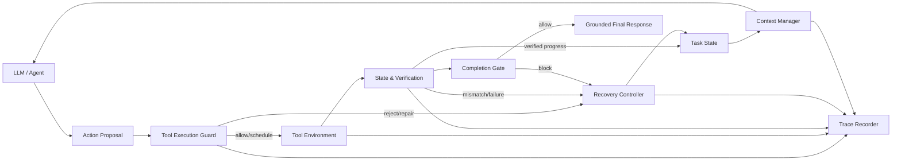

# SafeDesk：面向长程工具智能体的证据驱动运行时治理框架

**SafeDesk: Evidence-Grounded Runtime Governance for Long-Horizon Tool-Using Agents**

> 预印本工作稿 v0.1，2026-07-22  
> 作者：待定  
> 机构：待定  
> 代码与数据地址：待匿名化策略确定后补充

## 摘要

大语言模型智能体能够通过函数调用操作应用程序、数据库与外部服务，但长程任务中的失败往往并非单一推理错误。智能体可能遗忘原始约束、遗漏子目标、调用未暴露或参数不合法的工具、重复产生写副作用、在失败后盲目重试，或在缺少环境证据时宣布任务完成。现有 Agent harness 通常保存消息历史和工具返回，却缺少对任务状态、执行效果、验证证据、恢复策略和上下文预算的统一运行时约束。

本文提出 SafeDesk，一个不依赖模型权重更新的证据驱动运行时治理框架。SafeDesk 将长程工具执行建模为受任务合同约束的状态转换过程，并由四个核心模块协同治理：State & Verification 维护任务状态、证据板、效果账本和完成门；Tool Execution Guard 负责 Schema 校验、策略约束、依赖调度、幂等保护与动态工具解析；Recovery Controller 对失败进行类型化分类，并在有限预算内执行恢复和停滞控制；Context Manager 将长轨迹投影为满足关键不变量的受预算上下文。所有决策、拦截、验证和恢复均进入结构化 Trace，以支持复现与模块消融。

我们首先对已有未治理基线进行失效分析。在修复状态持久化与 Windows 编码问题后，DeepSeek V4 Flash no-thinking 在 AppWorld `test_challenge` 的 417 个任务上取得 41.73% Task Goal Completion 和 29.50% Scenario Goal Completion。失败任务平均消耗 737,614 Token，而成功任务为 130,653 Token；达到最大轮数、Schema 外调用和重复调用均与失败显著伴随。现有 τ² 基线覆盖 278 个任务，提供跨领域的对话式工具使用诊断，但其模型角色与 Token 口径尚不适合作为 SafeDesk 主对照。本文报告系统设计、实现规模、可复现数据协议和预注册式实验方案。SafeDesk 对准确率、可靠性和效率的完整因果效果仍待匹配模型的对照与消融实验验证。

**关键词：** LLM Agent；工具调用；运行时治理；状态验证；失败恢复；上下文管理；AppWorld；τ²-bench

## Abstract

Long-horizon tool-using agents fail for reasons that extend beyond isolated reasoning errors. They may drift from the original goal, omit subgoals, invoke invalid or unavailable tools, repeat side-effecting actions, retry blindly after failures, or declare completion without evidence from the environment. We present **SafeDesk**, an evidence-grounded runtime governance framework that does not require updating model weights. SafeDesk represents execution as task-constrained state transitions and coordinates four modules: State & Verification, Tool Execution Guard, Recovery Controller, and Context Manager. Structured traces record state, evidence, effects, interventions, and recovery decisions for diagnosis and ablation.

As a diagnostic baseline, a repaired no-thinking DeepSeek V4 Flash function-calling runner achieves 41.73% Task Goal Completion and 29.50% Scenario Goal Completion on all 417 AppWorld `test_challenge` tasks. Failed tasks consume 737,614 tokens on average, compared with 130,653 for successful tasks, and max-turn exhaustion, out-of-schema attempts, and duplicate calls are strongly associated with failure. We describe the system, its implementation, a reproducible data protocol, and a preregistered evaluation design. Full matched-model experiments are pending; therefore, this draft makes no claim that SafeDesk improves benchmark performance.

## 1. 引言

以 ReAct 为代表的智能体范式将推理与环境行动交错执行，使语言模型能够通过 API、搜索、数据库和应用程序完成开放式任务 [@yao2023react]。当任务从一次查询扩展到跨应用、多步骤、带副作用的长程工作流后，单纯增加提示长度或允许更多轮次并不能保证可靠性。错误可能在多个层面累积：任务目标在对话中漂移，工具选择器漏掉关键 API，写操作在未知状态下并发，工具返回“成功”但环境未发生预期变化，失败后重复执行相同动作，最终回答又与真实状态不一致。

AppWorld 提供 9 个应用、457 个 API 和 750 个任务，并通过最终状态测试与 collateral-damage 检查评估智能体 [@trivedi2024appworld]。τ²-bench 则把用户模拟、领域政策、工具操作和数据库终态放入动态对话，强调单次成功率之外的多次运行一致性 [@yao2024taubench]。这两类基准共同说明：长程工具智能体不仅需要“做出动作”，还需要知道当前目标是什么、动作是否实际生效、何时应恢复、何时可以结束。

本文研究以下问题：能否在不训练模型权重的情况下，通过通用 harness 层的运行时治理，提升工具智能体的可控性、可解释性和资源效率，并逼近一部分 Agentic RL 所带来的执行收益？近期工作表明，Agentic RL 能够显著提升 Qwen3-14B 等模型在多轮工具任务中的表现 [@hu2026seeupo]；AppWorld 官方榜单也记录了 Qwen3-14B AgentRL 方法的高分结果 [@appworldleaderboard2026]。SafeDesk 不试图替代训练，而是探索互补方向：将任务合同、执行证据和恢复控制显式放入运行时。

本文的主要贡献是：

1. 提出一个由任务状态、证据、效果、失败和上下文构成的统一运行时模型，将“完成”从模型的语言声明转化为可验证判定。
2. 设计四个可组合模块，分别治理状态与验证、工具执行、类型化恢复和上下文预算，并通过统一协调器形成闭环。
3. 实现结构化协议、JSON Schema、Trace 记录、DeerFlow 适配和 AppWorld 离线转换能力，为跨 harness 集成与消融提供基础。
4. 建立覆盖 TGC、SGC、假完成候选、最大轮数、非法调用、重复写入、恢复、Token 和时长的可复现指标体系。
5. 给出完整基线诊断与冻结实验计划，同时严格区分实测结果、诊断证据和待测假设。

## 2. 问题定义

### 2.1 长程工具任务

令任务合同为：

\[
\mathcal{T} = (G, C, P, V),
\]

其中，\(G\) 是目标与子目标集合，\(C\) 是用户约束和不变量，\(P\) 是工具与业务政策，\(V\) 是完成判定所需的验证规范。智能体在第 \(t\) 步观察上下文 \(X_t\)，提出一个或多个工具动作 \(A_t\)。环境执行后产生工具结果 \(O_t\) 和真实状态变化 \(\Delta S_t\)。

传统 harness 往往把消息历史视为主要状态。SafeDesk 区分六种对象：

- **Task State \(S_t\)**：目标、子目标、约束、已知实体、待解决阻塞和阶段。
- **Evidence Board \(E_t\)**：来自工具结果或环境回读、带来源与新鲜度的事实。
- **Effect Ledger \(L_t\)**：写动作意图、实际效果、幂等键和验证状态。
- **Failure State \(F_t\)**：失败类别、可恢复性、累计尝试与预算。
- **Context Pack \(C_t\)**：发送给模型的受预算视图，而非完整原始轨迹。
- **Trace \(R\)**：所有状态转移、决策、工具调用和验证的审计记录。

### 2.2 可靠完成

模型调用 `complete_task` 只表示完成意图，不直接表示成功。SafeDesk 的完成门可抽象为：

\[
\operatorname{Complete}(S_t,E_t,L_t) =
\bigwedge_{g \in G_{req}} \operatorname{satisfied}(g)
\land \bigwedge_{e \in L_{req}} \operatorname{verified}(e)
\land \neg \operatorname{unresolvedBlocker}(S_t)
\land \operatorname{policySatisfied}(P).
\]

只有必要子目标已满足、必要写效果已验证、阻塞已解决且政策条件成立时，Completion Gate 才允许结束。该定义将自然语言自评与环境事实分离。

### 2.3 研究假设

- **H1：效果。** 在模型与预算匹配的条件下，SafeDesk 提高 AppWorld TGC 和 SGC。
- **H2：可靠性。** SafeDesk 降低假完成、Invalid Call、重复写操作和 Max-Turn Rate。
- **H3：效率。** SafeDesk 通过停滞控制与上下文投影降低失败任务的 Token 长尾，其附加验证成本小于被消除的无效循环成本。
- **H4：模块贡献。** 四个核心模块对不同失败模式产生可区分的增益，完整系统优于任一单模块配置。

以上均是待检验假设，不是本文当前版本已经证实的结论。

## 3. 相关工作

### 3.1 推理与行动智能体

ReAct 通过交错生成推理与动作提升交互式决策能力 [@yao2023react]。Reflexion 使用语言反馈和情景记忆改善后续尝试 [@shinn2023reflexion]。这类方法主要改变模型的推理或反馈过程，而 SafeDesk 关注独立于模型的执行控制面：即使模型提出错误动作，运行时仍能校验、调度、验证并记录。

### 3.2 工具智能体评测

AppWorld 强调跨应用任务、复杂控制流和最终状态评测 [@trivedi2024appworld]。τ²-bench 进一步覆盖用户交互、政策遵循和多次运行一致性 [@yao2024taubench]。SafeDesk 选择两者，是因为它们分别暴露了多应用状态管理与对话政策执行问题。

### 3.3 智能体安全与守护

ToolEmu 通过语言模型模拟工具环境来发现高风险行为，并使用自动安全评估器分析失败 [@ruan2024toolemu]。GuardAgent 使用独立 guard agent 和可执行规则检查目标智能体的动作 [@xiang2025guardagent]。SafeDesk 与这些工作互补：它不只判断动作是否违反安全要求，还把子目标状态、实际效果、写后验证、恢复与上下文预算纳入同一生命周期。

### 3.4 Agentic RL 与运行时方法

Qwen3 同时支持 thinking 与 non-thinking 模式 [@yang2025qwen3]。SeeUPO 等工作展示了在多轮 Agent 任务上训练策略的收益 [@hu2026seeupo]。训练可以改变模型的动作分布，运行时治理则能提供确定性约束、审计和跨模型复用。我们的最终实验将以 Qwen3-14B no-thinking 的纯 function-calling runner 为匹配基线，测试 harness 层改进能够覆盖哪些 RL 所解决的失败类型。

## 4. SafeDesk 架构

**图 1：** SafeDesk 的运行时闭环。模型只提出动作，执行与完成均需经过结构化治理。

统一协调器按以下顺序处理每轮：任务状态归约、上下文构建、动作规范化、Schema 与政策检查、依赖调度、效果预检、工具执行、结果投影、证据更新、写后验证、进展评估、失败分类、恢复决策和完成判定。所有阶段使用版本化数据合同连接，避免模块直接依赖某个 Agent 框架的消息对象。

## 5. 四个核心模块

### 5.1 State & Verification

该模块解决目标漂移、子任务遗漏、假完成和“工具返回成功但状态未改变”。

**Task State** 将原始请求归约为可追踪的子目标、约束、实体与阻塞。状态变化使用显式 transition，而不是从完整聊天历史临时重建。

**Evidence Board** 保存事实、来源、时间、新鲜度和适用子目标。模型声称、工具请求和工具结果彼此区分；只有允许的证据类型可满足完成条件。

**Effect Ledger** 为写动作记录意图、目标资源、幂等键、执行状态和验证状态。相同幂等键可用于阻止重复创建、重复发送和重复修改。

**Post-action Verification** 根据 Verifier Spec 对写操作执行回读或状态差异检查。若工具返回成功但真实状态不符，则产生 verification failure，而不是将步骤标为完成。

**Completion Gate** 聚合子目标、证据、效果、政策和阻塞信息。门被拒绝时返回结构化 blocker，供 Recovery Controller 选择后续动作。

**Response Grounding** 检查最终答复是否与已验证状态一致，防止“工具失败但回复成功”。

### 5.2 Tool Execution Guard

该模块解决参数错误、重复副作用、错误并行、政策违规和工具集合缺失。

1. **Normalizer** 将模型调用转换为统一 Action IR。
2. **Schema Guard** 验证工具名、必填参数、类型和枚举，并输出可供修复的字段级错误。
3. **Policy Gate** 在执行前检查身份验证、用户确认、权限和业务规则。
4. **Effect Guard** 依据 Effect Ledger 与幂等键识别已完成或高风险重复写入。
5. **Dependency Scheduler** 按读写类型、实体依赖和状态刷新边界调度调用。只读动作可顺序批量执行；包含写入时，只执行当前安全的动作，其余调用获得明确的未执行结果。
6. **Dynamic Tool Resolver** 在 active schema 缺少必要工具时，从目录中受控扩展，而不是执行未暴露工具或让 Agent 永久停滞。

每个模型 Tool Call 必须有对应 Tool Result。被拦截或延迟的调用也返回结构化状态，避免模型误以为动作已经执行。

### 5.3 Recovery Controller

该模块解决失败后盲目重试、相同错误循环和跑满最大轮数。

**Failure Classifier** 将失败映射为参数、Schema、实体、权限、政策、工具、环境、状态不一致、上下文和未知类别。分类结果包含可恢复性和推荐策略。

**Typed Recovery** 根据类别选择参数修复、重新查询、工具解析、状态刷新、局部重规划或有限重试。恢复策略以结构化计划执行，而不是给模型追加泛化的“再试一次”。

**Progress Monitor** 比较相邻状态、证据和效果，检测是否产生新实体、满足新子目标或验证新效果。

**Stagnation Detector** 结合相同调用签名、语义重复读取、重复失败类别和连续无进展轮次识别停滞。达到阈值时升级恢复或终止，而不是消耗剩余全部轮次。

**Recovery Budget** 限制同类恢复、总恢复和高成本路径，确保治理本身不会形成新循环。

### 5.4 Context Manager

该模块解决完整工具结果不断累积、关键约束被淹没和长轨迹退化。

Context Manager 不直接删除历史，而是从结构化状态构建 Context Pack：

1. 固定保留任务目标、硬约束、未满足子目标、已验证关键事实和未解决失败。
2. 将大体积 Tool Result 投影为必要字段，并保留指向原始 Trace 的引用。
3. 对已完成阶段生成可校验摘要，原始记录仍由 Trace Recorder 保存。
4. 按当前子目标检索相关证据与效果，而不是重发全部历史。
5. 在 Token Budget 内分配系统指令、任务状态、工具 Schema、近期交互和恢复信息。
6. 通过 Context Invariant 检查防止压缩过程丢失身份、金额、时间、禁止条件和幂等键。

Context Manager 的目标不是单纯减少 Token，而是在预算约束下最大化决策所需信息的保真度。

## 6. 实现

SafeDesk 当前实现由核心库、DeerFlow 适配器和 AppWorld 适配器组成。核心库包含 68 个 Python 文件、9,147 行物理代码和 35 个版本化 JSON Schema。四模块之外还包括 runtime、contracts 与 tracing。DeerFlow 适配器包含工具、状态、中间件和 journal 转换；AppWorld 适配器包含工具目录、Trace 转换、结果投影、验证器和 shadow audit。

仓库当前有 10 个核心测试文件和 54 个测试函数。需要强调的是，最终模块编辑后尚未执行完整单元测试与 benchmark，因此这些数字只描述实现规模，不构成正确性证据。投稿版本必须补充代码提交哈希、CI 结果、集成测试和端到端复现记录。

结构化协议覆盖 Action IR、Task Contract、Task State、Evidence Item、Effect Record、Verification Result、Failure Record、Recovery Plan、Context Pack、Guarded Tool Batch、Completion Gate Decision 和 Trace Event 等对象。Trace 对敏感字段执行脱敏，并把原始工具结果与模型可见投影分开保存。

## 7. 实验设计

### 7.1 基准

**AppWorld。** 主实验使用 `test_normal` 的 168 个任务和 `test_challenge` 的 417 个任务。TGC 是任务级成功率；SGC 要求同一场景的三个变体全部成功，因此比 TGC 更能反映策略稳定性 [@trivedi2024appworld]。

**τ²-bench。** 使用 airline、retail 和 telecom-base，覆盖用户对话、业务政策与数据库状态 [@yao2024taubench]。除单次 pass rate 外，正式实验将进行重复 trial 并报告 pass^k。

### 7.2 匹配基线

最终主对照使用相同 Qwen3-14B API 版本、no-thinking、温度 0、任务顺序、API 预测器、最大 20 个预测 API、最大 50 轮和相同 evaluator。基线与 SafeDesk 的唯一系统性差异应是四个治理模块。若服务端无法保证确定性，则记录每次请求参数与模型版本，并采用配对多次运行。

历史 DeepSeek 基线用于揭示失败模式，不替代 Qwen 匹配实验。AppWorld 官方榜单中 Qwen3-14B AgentRL 条目报告 `test_normal` 86.9% TGC、80.4% SGC，以及 `test_challenge` 67.6% TGC、50.4% SGC [@appworldleaderboard2026]。该结果来自不同训练和执行方法，只作为外部参照，不能与尚未运行的本地 Qwen API 基线直接作因果比较。

### 7.3 指标

主要指标为 TGC 和 SGC。可靠性指标包括假完成率、Max-Turn Rate、Invalid Call Rate、Out-of-Schema Rate、重复调用率、重复写操作率、验证覆盖率、验证失败率、Recovery 成功率和非预期副作用。效率指标包括 Agent/预测器 Token、平均/中位/P95/最大 Token、轮数、工具调用数、时长和成本。

“调用完成但 evaluator 失败”在自动统计中称为**假完成候选**，只有 Trace 审核确认 Agent 缺少足够完成证据时才计入正式假完成率。同理，失败任务通过至少一个子测试不能自动推出部分完成。

### 7.4 统计方案

二元率报告 Wilson 95% 置信区间。匹配任务的成功差异使用 McNemar 检验；Token、调用数和轮数使用 10,000 次任务级配对 bootstrap；多消融比较使用 Holm 校正。除 p 值外，报告绝对差、相对差和置信区间。完整执行方案见 `实验执行与统计计划.md`。

## 8. 现有实测结果

### 8.1 AppWorld `test_challenge` 基线

在修复状态持久化、用 UTF-8 重跑 11 个 Windows GBK 故障任务并离线重新评估最终状态后，DeepSeek V4 Flash no-thinking 的 plain function-calling 基线完成全部 417 项，基础设施错误为 0。API predictor 与 Agent 使用同一模型，最多预测 20 个 API，最大轮数为 50。

| 指标 | 结果 |
| --- | ---: |
| TGC | 174 / 417，41.73%（95% CI 37.09% 到 46.51%） |
| SGC | 41 / 139，29.50%（95% CI 22.55% 到 37.55%） |
| Evaluator test pass rate | 2218 / 3348，66.25% |
| Difficulty 1 TGC | 51 / 72，70.83% |
| Difficulty 2 TGC | 60 / 150，40.00% |
| Difficulty 3 TGC | 63 / 195，32.31% |
| 平均轮数 | 20.62 |
| 平均工具调用 | 35.09 |
| 平均 Token | 484,350 |
| 中位 Token | 136,548 |
| P95 Token | 2,056,783 |
| 最大 Token | 7,128,790 |

难度来自每个任务的 AppWorld `ground_truth/metadata.json`，不是任务 ID 后缀。

### 8.2 可靠性诊断

| 指标 | 数值 | 口径 |
| --- | ---: | --- |
| 未调用完成 | 90 / 417，21.58% | 90 项全部失败 |
| 达到最大轮数 | 91 / 417，21.82% | 仅 1 项成功 |
| 假完成候选 | 153 / 327，46.79% | 完成调用后 evaluator 失败，尚非人工确认假完成 |
| Invalid Call Rate | 559 / 15,066，3.71% | 分母为模型提出调用 |
| Out-of-Schema Rate | 435 / 15,066，2.89% | 435 次均未执行 |
| 重复调用率 | 987 / 14,631，6.75% | 分母为执行调用 |
| 重复写操作率 | 128 / 1,836，6.97% | 40 个任务受影响 |

含 Schema 外调用的 217 个任务通过率为 23.50%，无此标记的 200 个任务为 61.50%。含重复调用的 179 个任务通过率为 15.64%，无重复调用的 238 个任务为 61.34%。这些是描述性关联，不能解释为移除该标记就会产生相同幅度的因果提升，因为任务难度和轨迹长度可能同时影响二者。

### 8.3 失败成本

| 任务组 | 数量 | 平均轮数 | 平均工具调用 | 平均 Token |
| --- | ---: | ---: | ---: | ---: |
| 成功 | 174 | 9.67 | 18.96 | 130,653 |
| 失败 | 243 | 28.46 | 46.63 | 737,614 |

失败任务的平均 Token 是成功任务的约 5.65 倍。总 Token 为 201,973,864，其中输入 195,563,935、输出 6,409,929；读取调用占执行调用的 87.45%。按输入/输出每百万 Token 1/2 元估算成本为 208.38 元，按 3/6 元估算为 625.15 元。该结果支持把停滞检测和上下文管理作为主要研究对象，但尚不能证明 SafeDesk 能达到预期节省。

### 8.4 τ² 诊断基线

现有 τ² 基线使用 GLM-5 no-thinking 作为 Agent，DeepSeek V4 Flash no-thinking 作为用户模拟器和 judge，共 278 项。

| Domain | Tasks | Pass rate | DB match | Avg turns | Avg tool calls | Avg tokens |
| --- | ---: | ---: | ---: | ---: | ---: | ---: |
| Airline | 50 | 64.00% | 66.00% | 15.38 | 7.08 | 65,337 |
| Retail | 114 | 79.82% | 82.46% | 17.81 | 7.84 | 79,419 |
| Telecom | 114 | 99.12% | 23.68% | 37.95 | 6.61 | 253,553 |
| Overall | 278 | 84.89% | 55.40% | 25.63 | 7.20 | 148,294 |

Telecom 的 DB match 是原 evaluator 的组成部分，不等同最终 pass。全量共 25 次 invalid call、11 次重复非写调用、5 次 recovery，其中 3 次成功；未观察到已确认的重复写动作。42 个失败任务的 premature finish、partial completion 和 unintended side effects 仍为 unknown，而不是 0。由于当前导出没有按 Agent、用户模拟器和 judge 分离 Token，该结果不能可靠换算 Agent 单独成本，也不能直接作为 SafeDesk 主对照。

### 8.5 Shadow audit

AppWorld 5 条 challenge smoke 轨迹被转换为统一格式，目录包含 457 个工具；转换得到 129 个动作、129 条证据、84 个效果、45 个读动作和 84 个写动作，没有缺失 Tool Result 或未知工具。保守 shadow audit 观察到 4 次完成尝试，因缺少完整 Task Contract、verified evidence 和已验证 effect，4 次均会被 Completion Gate 阻断。

该结果只证明转换与拦截路径能够表达现有轨迹，并揭示缺失合同的处理行为；它不是 SafeDesk 的性能结果，也不能说明四次拦截均为正确决策。

## 9. 待完成实验与消融

当前尚未运行以下决定论文结论的实验：

1. Qwen3-14B no-thinking 在 AppWorld `test_normal` 的 168 项匹配基线。
2. Qwen3-14B no-thinking 在 `test_challenge` 的 417 项匹配基线。
3. 相同模型与预算下的 SafeDesk `test_normal` 和 `test_challenge` 对照。
4. A0 到 A4 的递增模块消融，以及 B1 到 B4 的留一模块消融。
5. τ² 上模型角色和 Token 口径匹配的 baseline/SafeDesk 对照与 pass^k。
6. 假完成、部分完成和非预期副作用的 Trace 级复核。

投稿前的主结果表应采用以下结构，空格不得在实验完成前填入估计值：

| Model | Runtime | Split | TGC | SGC | False completion | Max-turn | Invalid calls | Duplicate writes | Avg tokens |
| --- | --- | --- | ---: | ---: | ---: | ---: | ---: | ---: | ---: |
| Qwen3-14B no-thinking | Baseline | test_normal | 待测 | 待测 | 待测 | 待测 | 待测 | 待测 | 待测 |
| Qwen3-14B no-thinking | SafeDesk | test_normal | 待测 | 待测 | 待测 | 待测 | 待测 | 待测 | 待测 |
| Qwen3-14B no-thinking | Baseline | test_challenge | 待测 | 待测 | 待测 | 待测 | 待测 | 待测 | 待测 |
| Qwen3-14B no-thinking | SafeDesk | test_challenge | 待测 | 待测 | 待测 | 待测 | 待测 | 待测 | 待测 |

## 10. 讨论

### 10.1 为什么是运行时治理

模型能力决定可提出的计划和动作上限，但真实系统还要求确定性约束。身份验证、金额上限、幂等、防重复发送和完成证据不应完全依赖随机生成。SafeDesk 把这些要求变成数据结构与运行时决策，使同一治理层可以复用于不同模型和 harness。

### 10.2 准确率与保守性的权衡

过强的 Completion Gate 可能阻断实际上已完成但缺少显式证据的任务；过频繁的写后回读也会增加 Token 和延迟。因此需要同时报告 TGC/SGC、误阻断率、验证覆盖和治理开销。Shadow 模式应先观察而不干预，再逐步切换到 enforce 模式。

### 10.3 Dynamic Tool Resolver 的边界

工具预测器漏 API 是 AppWorld 基线的重要失败标记，但无限扩展 Schema 会增加 Token、选择歧义和攻击面。Resolver 应基于当前子目标、失败证据和应用范围受控检索，并记录每次扩展的理由、候选集合和最终选择。

### 10.4 与 Agentic RL 的关系

Agentic RL 可让模型学习更优的长程策略，SafeDesk 则提供外部状态、执行约束和可审计恢复。二者可能互补：训练后的模型仍可能受益于幂等、政策门和真实状态验证；运行时轨迹也可提供更细粒度的训练信号。本文首先检验无需训练的 harness 上限，后续可研究 SafeDesk 与 Agentic RL 的组合。

## 11. 有效性威胁与局限

1. **SafeDesk 主效果尚未测量。** 当前稿不能声称系统提高准确率、降低 Token 或优于 RL。
2. **历史 `test_normal` 失效。** 168 项旧结果发生在状态持久化修复前，仅供审计；5/5 状态保存 smoke 不能替代全量重跑。
3. **Qwen pilot 不可用。** 现有 5 项 train pilot 开启了 thinking，且样本非代表性，不是目标 Qwen no-thinking 基线。
4. **基准适配差异。** AppWorld 原始任务强调交互式编码，本研究使用 function calling；与官方不同 runner 的绝对分数只能谨慎比较。
5. **模型服务漂移。** API 模型标识可能映射到更新后的权重或服务配置，必须保存供应商返回版本和运行时间。
6. **关联不等于因果。** Schema 外调用、重复调用与失败的关系可能受任务难度混杂。
7. **标注不足。** 假完成、部分完成和副作用需要目标级 evaluator 或人工复核，不能由最终失败自动推断。
8. **τ² Token 混合。** 现有数据未区分 Agent、用户和 judge，正式实验必须修复。
9. **平台问题。** Windows 时间冻结、GBK 编码和状态保存曾影响结果；虽然主 challenge 基线已修复并重评，后续仍需跨平台复现。
10. **实现验证未完成。** 当前代码规模和 Schema 数量不代表正确性；最终测试和 benchmark 集成尚待执行。

## 12. 伦理与安全

SafeDesk 旨在减少工具智能体的错误副作用，而不是扩大其权限。系统默认遵循最小权限、显式确认、敏感字段脱敏和完整审计。动态工具解析不得绕过业务政策；Recovery 不得通过更换路径规避权限失败；Trace 数据发布前应删除 API key、账号、个人数据和可重放凭证。

基准中的写操作发生在隔离环境。将系统部署到真实服务前，还需要领域政策审查、人工接管机制、速率与金额限制、撤销路径以及事故响应流程。

## 13. 结论

本文提出 SafeDesk，将长程工具智能体的执行过程从无约束消息循环重构为证据驱动的状态转换系统。四个核心模块分别处理状态与验证、工具执行、类型化恢复和上下文预算，并由结构化 Trace 支持审计和消融。现有 AppWorld 全量基线表明，失败任务循环、完成证据不足、Schema 缺失、重复动作和 Token 长尾是具体且可测的工程问题。

当前版本已经完成系统设计、核心实现、数据协议和基线诊断，但尚未完成匹配 Qwen3-14B 的 SafeDesk 对照实验。因此，本文最重要的下一步不是润色结论，而是按照冻结方案运行 E2 到 E5 与模块消融，并让每项新声明都能追溯到任务级结果和 Trace。只有这些实验完成后，SafeDesk 才具备正式 arXiv 投稿所需的实证闭环。

## 附录 A. 数据与复现材料

论文数据由 `paper/scripts/build_paper_data.py` 从本地原始结果生成。`paper/data/data_manifest.json` 保存输入与输出 SHA-256。主要文件包括：

- `appworld_primary_metrics.csv`：AppWorld 主基线汇总、置信区间与成本。
- `appworld_task_level_derived.csv`：417 项任务级去敏派生数据。
- `appworld_difficulty.csv`：基于官方 metadata 的难度分层。
- `appworld_failure_associations.csv`：失败标记的描述性关联。
- `tau2_baseline_metrics.csv` 与 `tau2_task_level_derived.csv`：τ² 汇总和 278 项任务级数据。
- `artifact_validity.csv`：历史结果、smoke 和诊断数据的有效性分层。
- `experiment_matrix.csv` 与 `ablation_matrix.csv`：待运行实验和消融条件。
- `metrics_dictionary.csv`：统计字段的统一定义。
- `claims_registry.csv`：论文声明与证据准入状态。

## 附录 B. 当前声明边界

当前可以声明：四模块与统一 runtime 已实现；417 项 AppWorld challenge 基线和 278 项 τ² 基线已有可追溯数据；失败任务存在明显 Token 长尾；Schema 外调用、重复调用和最大轮数与失败伴随。

当前不能声明：SafeDesk 提升 TGC/SGC；SafeDesk 降低 Token；SafeDesk 优于 Qwen3-14B AgentRL；四模块中的任一模块产生确定增益；shadow audit 的所有拦截均正确。
